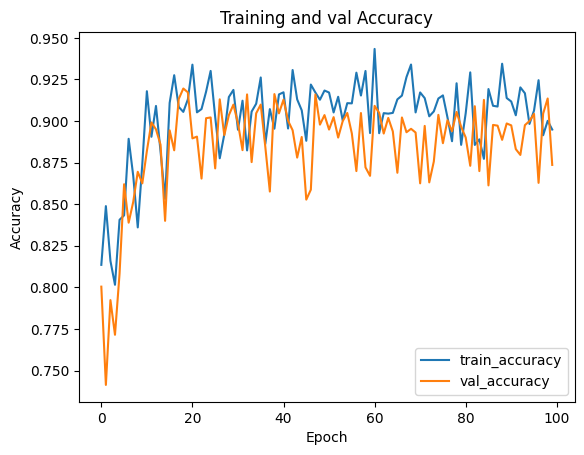
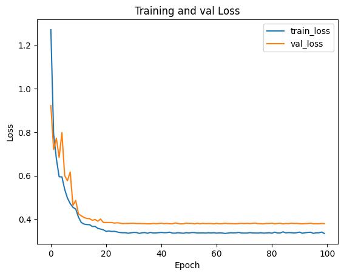

# CV_MSDS_Assignment3
## Syed Saad Ullah Shah
## 400202

### Sentiment Analysis

#### Abstract
This paper investigates the effectiveness of using different backbone
models, including VGG11, VGG13, VGG19, and MobileNetV2, in com-
bination with the U-Net architecture for semantic segmentation on a city
dataset. The study compares the performance of these models and evalu-
ates their suitability for urban scene understanding. Experimental results
reveal the impact of each backbone model on segmentation accuracy
and computational efficiency, providing valuable insights for selecting
the most appropriate model in urban computer vision applications.

#### Architecture

#### Results

#### Traiing and Validation Graphs
##### UNet with VGG-11 Backbone

##### UNet with VGG-13 Backbone

##### UNet with VGG-19 Backbone

##### UNet with MobiuleNet-V2 Backbone

#### Testing Results

